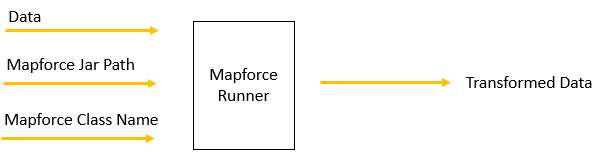
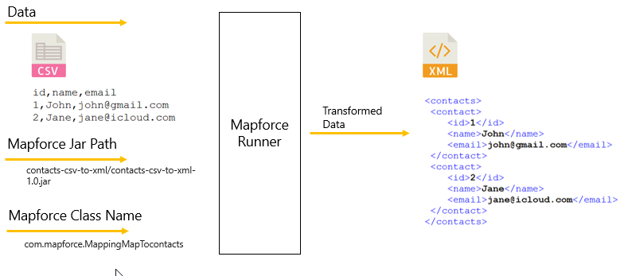
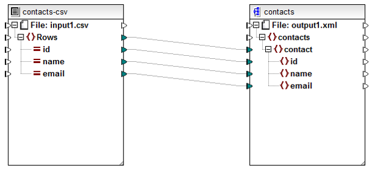
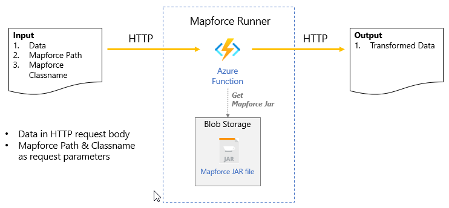

# mapforce-runner-azure-function

## Objective
To have 1 common azure function that can run any mapforce jar as follow:

## Sample Use case

## Notes
This package is :
- a proof of concept version
- gives an azure function, a common function that will dynamically load and run mapforce jars **during runtime**
- works for simple mapping pattern where there are exactly : 1 input component & 1 output component, refer to diagram below
- data will be treated as "String" in and "String" out.
- input/output format can be anything - json, xml, csv, dsv, fixedlength, complex, edi, etc - as long as the mapforce mapping design follow exactly the pattern : 1 input & 1 output

## Design

1. Azure function:
    - Doesn't need mapforce jars during compile time. 
    - Mapforce JARS are kept in blob storage.
    - They will be dynamically loaded during runtime per request.
    
2. Blob storage is also in Azure 

## Steps to run

1. Create Azure required resources: 
   - Resource group
   - Storage account + blob container
   - Blank Java Function App
   
2. Set up local development environment:
   - IDE
   - JDK 11
   - Azure CLI 2.23
   - Azure Core Tools 3.0.x
   - Maven 3
   - Ant (for creating mapforce jars)
   - REST Client (Postman/Soap UI, for testing)

4. Clone this repository
   
5. Copy the given jar **contacts-csv-to-xml-1.0.jar** to azure blob storage created in step 1, take note of the:
   - Blob container name : mapforcejar-container
   - Blob path : contacts-csv-to-xml/contacts-csv-to-xml-1.0.jar
   
6. Update local.settings.json, change this setting to approriate connection string:
   
        "MapforceBlobConnectionString" : "changethis"

7. Update pom.xml, change this setting as well:

         <MapforceBlobConnectionString>changethis</MapforceBlobConnectionString>
   
8. To test locally, run:
   
        mvn clean package
        mvn azure-functions:run
   
9. Once function is running locally, use the sample input data (input1.csv) and rest client to send http post data to following endpoint:
   
        curl --location --request POST 'http://localhost:7071/api/mapforcerunner?mapforcejarpath=contacts-csv-to-xml/contacts-csv-to-xml-1.0.jar&mapforceclassname=com.mapforce.MappingMapTocontacts' \
        --header 'Content-Type: text/plain' \
        --data-raw 'id,name,email
        1,John,john@singpost.com
        2,Jane,jane@qs.com
        3,Mark,mark@cp.com.au
        4,Kat,kat@qs.co.jp'
   

10. To deploy to Azure, update pom.xml change "azure-functions-maven-plugin" configuration accordingly:

         <appName>change-this-to-what-was-created-in-step-1</appName>
         <resourceGroup>change-this-to-what-was-created-in-step-1</resourceGroup>
         
11. Then run:
    
         mvn azure-functions:deploy
    
12. Go to Azure Portal > function app > configurations, add these settings:
    
        MapforceBlobConnectionString : connection_string_to_blob
        MapforceBlobContainerName : mapforcejar-container

13. Test again using the online endpoint provided by azure function app

        https://{functionAppName}.azurewebsites.net/api/mapforcerunner

    > At the end of step 10, the endpoint url will be shown in console. 
    > You can also get the endpoint url from Azure Portal.

